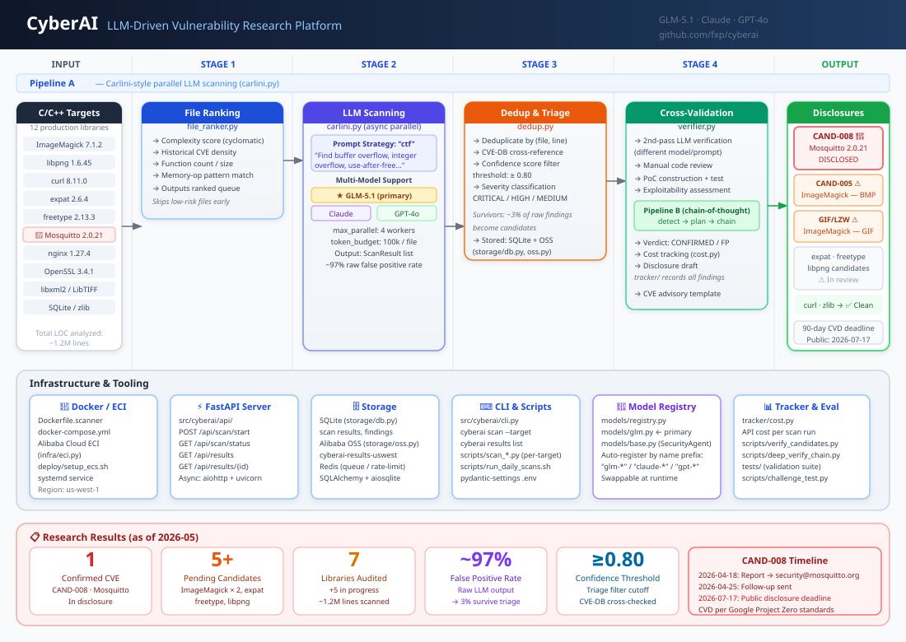

# CyberAI — LLM-Driven Vulnerability Research Platform

> **Status**: Active Research | First disclosed vulnerability: CAND-008 (Mosquitto)  
> **Team**: Xiaoping Feng et al. | **Model**: GLM-5.1

---

## What is CyberAI?

CyberAI is a research project demonstrating that large language models can **discover real, previously unknown software vulnerabilities** — not just answer security questions.

We scan production C/C++ open-source libraries with GLM-5.1, cross-validate findings manually, and produce CVE-ready disclosure reports. Our first confirmed candidate, CAND-008 in Eclipse Mosquitto, is currently in responsible disclosure.

---

## Architecture



### Pipeline A — Carlini-style parallel scanning (`carlini.py`)

| Stage | Module | What it does |
|-------|--------|-------------|
| **1. File Ranking** | `file_ranker.py` | Scores files by cyclomatic complexity, historical CVE density, memory-op patterns — skips low-risk files early |
| **2. LLM Scanning** | `carlini.py` | Async parallel prompting (max 4 workers, 100k token/file) across GLM-5.1 / Claude / GPT-4o |
| **3. Dedup & Triage** | `dedup.py` | Deduplicates, cross-references CVE-DB, applies confidence ≥ 0.80 filter — drops ~97% false positives |
| **4. Cross-Validation** | `verifier.py` | Second-pass LLM verification with different model/prompt, manual review, PoC construction |

### Pipeline B — Chain-of-thought deep verification (`pipeline_b_*.py`)

Multi-step reasoning for complex candidates: `detect → plan → chain`. Used when Pipeline A surfaces a high-confidence finding that requires deeper analysis.

**Key insight**: The hard problem is not "getting LLM to find bugs" — it's filtering the 97% false positives to surface the 3% real ones.

---

## Targets & Status

| Target | Version | Segments Scanned | Candidates | Confirmed | Status |
|--------|---------|-----------------|-----------|-----------|--------|
| ImageMagick | 7.1.1-44 | 41/41 | 3 | 2 (GIF/BMP) | ⚠️ Pending verification |
| libpng | 1.6.43 | Full | 1 | 1 (candidate) | ⚠️ In review |
| curl | 8.11.0 | 14/14 | 0 | 0 | ✅ Clean |
| expat | 2.6.x | Full | 1 | Pending | ⚠️ In review |
| freetype | 2.13.x | Full | 1 | Pending | ⚠️ In review |
| **Eclipse Mosquitto** | **2.0.21** | **22/22** | **4** | **1 (CAND-008)** | **🔴 Disclosed** |
| LibTIFF | 4.7.0 | 39/43 | 2 | 0 (FP confirmed) | ✅ Audited |

---

## CAND-008: Eclipse Mosquitto — Our First Disclosure

- **Type**: Logic/resource management vulnerability in MQTT session handling
- **Component**: `src/session_expiry.c` / `src/handle_*.c`
- **Impact**: Potential denial-of-service or resource exhaustion in IoT broker deployments
- **Disclosure Timeline**:
  - 2026-04-18: Initial report sent to security@mosquitto.org
  - 2026-04-25: Follow-up if no response
  - 2026-07-17: Public disclosure (90-day deadline)
- **Status**: Awaiting vendor acknowledgment

---

## Repository Structure

```
cyberai/
├── src/cyberai/
│   ├── scanner/
│   │   ├── carlini.py       # Pipeline A: parallel LLM scanning engine
│   │   ├── file_ranker.py   # Stage 1: complexity + CVE-density scoring
│   │   ├── dedup.py         # Stage 3: dedup, triage, confidence filter
│   │   └── verifier.py      # Stage 4: second-pass cross-validation
│   ├── models/
│   │   ├── registry.py      # Multi-model factory (GLM / Claude / GPT-4o)
│   │   ├── glm.py           # GLM-5.1 adapter (primary)
│   │   └── base.py          # SecurityAgent base class + ScanResult
│   ├── api/                 # FastAPI server (scan management REST API)
│   ├── infra/eci.py         # Alibaba Cloud ECI deployment
│   ├── storage/             # SQLite (db.py) + Alibaba OSS (oss.py)
│   ├── tracker/cost.py      # API cost tracking per run
│   └── cli.py               # CLI: cyberai scan / results
├── scripts/
│   ├── scan_*.py            # Per-target scan scripts (12 libraries)
│   ├── pipeline_b_*.py      # Pipeline B: detect / plan / chain
│   ├── verify_candidates.py # Candidate verification runner
│   └── run_daily_scans.sh   # Scheduled scan automation
├── research/
│   ├── */vulnerability_report.md   # Per-library findings
│   └── disclosures/                # CVE disclosure drafts (redacted)
├── docs/architecture.svg    # System architecture diagram
├── targets/                 # C/C++ source code (12 libraries, ~1.2M LOC)
├── Dockerfile.scanner       # Scanner container image
├── docker-compose.yml       # Self-contained scan environment
└── deploy/                  # ECS / systemd deployment configs
```

---

## Research Goals

1. **Prove LLMs can find real CVEs** — not just classify known vulnerabilities
2. **Quantify model capability** — benchmark GLM-5.1 vs Claude vs GPT-4o on security tasks
3. **Build reusable tooling** — open-source the scanner pipeline post-disclosure

---

## Security & Ethics

- We follow **Coordinated Vulnerability Disclosure (CVD)** per Google Project Zero standards
- All findings are privately reported to maintainers before any publication
- Technical details of unconfirmed candidates are kept confidential
- We do **not** release PoC code until patches are published

---

## Evaluation Framework (Upcoming)

After completing our first disclosure cycle, we plan to publish a comparative study:

| Model | Targets Scanned | True Positives | False Positive Rate | Time per 1k LOC |
|-------|----------------|---------------|-------------------|----------------|
| GLM-5.1 | 7 | TBD | ~97% | TBD |
| Claude 3.7 | TBD | TBD | TBD | TBD |
| GPT-4o | TBD | TBD | TBD | TBD |

---

## Running the Scanner

```bash
# Setup
git clone <repo>
cd cyberai
cp .env.example .env  # Add your GLM API key

# Run scan on a target
docker-compose up -d
python src/scanner.py --target mosquitto --version 2.0.21 --model glm-5.1

# View triage report
python src/triage.py --report research/scan_latest.json --confidence 0.8
```

**Requirements**: Docker, Python 3.11+, GLM-5.1 API access

---

## Contact

Research inquiries: [Create an issue] | Security disclosures follow CVD — contact project maintainers first.

---

*This project is for defensive security research only. All vulnerability details are handled per responsible disclosure protocols.*
