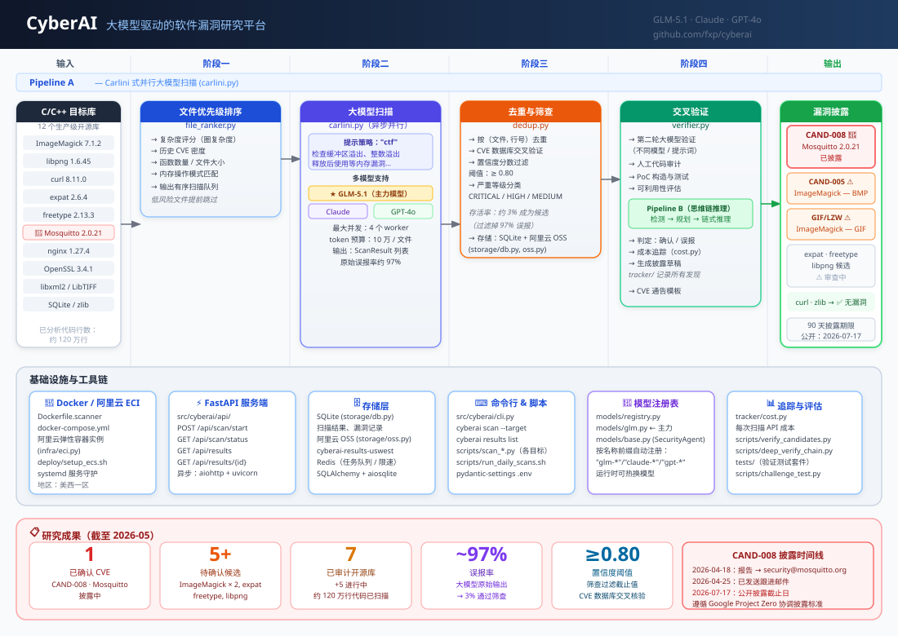

# CyberAI — 大模型驱动的软件漏洞研究平台

> 使用 GLM-5.1 扫描生产级 C/C++ 开源库，交叉验证发现结果，并在协调披露机制（90 天）下生成 CVE 级漏洞报告。

**状态**：活跃研究中 · 2026  
**主力模型**：glm-5.1（BigModel）用于检测与验证，glm-4-plus 用于交叉核验  
**站点**：https://fxp.github.io/cyberai/ · [docs/index.html](./docs/index.html)  
**架构图**：[docs/architecture.zh.svg](./docs/architecture.zh.svg) · [docs/architecture.html](./docs/architecture.html)

[English](./README.md) | **中文**

---

## 系统架构



---

## 流水线

```
A. scan_<target>_t1.py       Pipeline A    glm-5.1      单目标静态提取扫描
C. run_daily_scans.sh        编排器        glm-5.1      ~20h，全部 10 个目标
B. .github/workflows/        Pipeline B    glm-5.1      Agentic 模式，GHA，任意 repo
   pipeline_b.yml
H. verify_findings.py        对抗验证      glm-5.1      重新判定 CRITICAL+HIGH
J1. validate_findings.py     NVD CVE       （无 LLM）   过滤已知公开漏洞
J2. validate_findings.py     代码定位      （无 LLM）   丢弃无法定位的提取段
J3. validate_findings.py     跨模型核验    glm-4-plus   携带代码的第二方意见
J5. generate_drafts.py       草稿生成      glm-5.1      协调披露邮件
```

在 ECS 上完整跑完 A→H→J1+J2+J3→J5 一个周期，每 ~20 美元可产出 5–15 个高置信度候选发现。

---

## 扫描目标

| 目标 | 状态 |
|---|---|
| **libpng 1.6.45 — 1.6.58** | 🟢 **主线** — `png_combine_row` 整数溢出已定位；32 位 ASAN PoC 待完成 |
| libxml2 2.13.5 | 🟡 J3 部分通过 — `xmlXPathNextAncestor` 类型混淆，可利用性较窄 |
| ImageMagick 7.1.2 | ⚠ 等待验证（CAND-005、006/007） |
| Eclipse Mosquitto 2.0.21 | ⚪ 2026-04-18 已报告，专家评审后降级（低危 DoS） |
| libssh2 1.11.1 | ⚠ 多处 H-CONFIRMED，但 J3 定位失败；需改进提取段 |
| freetype 2.13.3 | ⚠ 同 libssh2 |
| expat 2.6.4 | ⚠ 同上 |
| sqlite 3.49.1 | ✓ 已审计（多为已知 CVE 召回） |
| openssl 3.4.1 | ✓ 已审计 |
| nginx 1.27.4 | ✓ 已审计 |
| zlib 1.3.1 | ✓ 无漏洞 |
| curl 8.11.0 | ✓ 无漏洞 |

最新运行摘要见 [`research/scan-2026-05-04/README.md`](./research/scan-2026-05-04/README.md)。

---

## 关键数据

| 指标 | 数值 |
|------|------|
| 已确认 CVE | **1**（CAND-008 · Mosquitto，披露中） |
| 待确认候选 | **5+**（ImageMagick × 2、expat、freetype、libpng） |
| 已审计开源库 | **7**（+5 进行中） |
| 已扫描代码行数 | **约 120 万行** |
| 大模型原始误报率 | **~97%**（筛查后 3% 成为候选） |
| 置信度阈值 | **≥ 0.80** |

---

## 核心洞察

> **难点不在于让大模型发现漏洞，而在于把 97% 的误报过滤掉，让真正的 3% 浮现出来。**

---

## 给 AI Agent 的说明

在此仓库中操作之前，请先阅读 [`AGENTS.md`](./AGENTS.md)。  
文档涵盖：ECS/OSS/GHA 基础设施、每个脚本的用途与输入输出、常用操作、已知坑点、成本参考，以及漏洞披露协议。

---

## Pipeline 架构详解

### Pipeline A — Carlini 式并行扫描（`carlini.py`）

| 阶段 | 模块 | 功能说明 |
|------|------|---------|
| **一、文件排序** | `file_ranker.py` | 按圈复杂度、历史 CVE 密度、内存操作模式对文件评分，低风险文件提前跳过 |
| **二、LLM 扫描** | `carlini.py` | 异步并行提示（最多 4 个 worker，每文件 10 万 token）跨 GLM-5.1 / Claude / GPT-4o |
| **三、去重筛查** | `dedup.py` | 去重、CVE-DB 交叉验证、置信度 ≥ 0.80 过滤，丢弃约 97% 误报 |
| **四、交叉验证** | `verifier.py` | 换模型 / 换提示词做第二轮验证、人工审计、PoC 构造 |

### Pipeline B — 思维链深度验证（`pipeline_b_*.py`）

对 Pipeline A 产出的高置信度候选进行多步推理：`检测 → 规划 → 链式推理`。  
当候选发现需要更深层分析时启用。

---

## 基础设施

```
本地开发        →  Docker / docker-compose
云端扫描        →  阿里云 ECI（弹性容器实例）·  deploy/setup_ecs.sh
对象存储        →  阿里云 OSS（cyberai-results-uswest）
本地数据库      →  SQLite（storage/db.py）
任务队列/限速   →  Redis
API 服务        →  FastAPI + uvicorn（src/cyberai/api/）
持续集成        →  GitHub Actions（.github/workflows/）
```

---

## 安全与伦理

- 所有发现均在公开前**私下通知上游维护者**。
- 未确认候选的技术细节**保密处理**。
- **在补丁发布之前不发布 PoC 代码**。
- 遵循 **Google Project Zero 标准**的 90 天默认披露窗口。

研究咨询请提 GitHub Issue；针对具体发现的安全披露，请通过相关草稿邮件中记录的渠道直接联系维护者。

---

## 许可证

防御性安全研究用途。代码部分适用 MIT 许可（如适用）。  
漏洞数据与披露草稿**不得再发布**。
